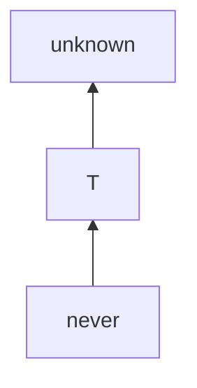
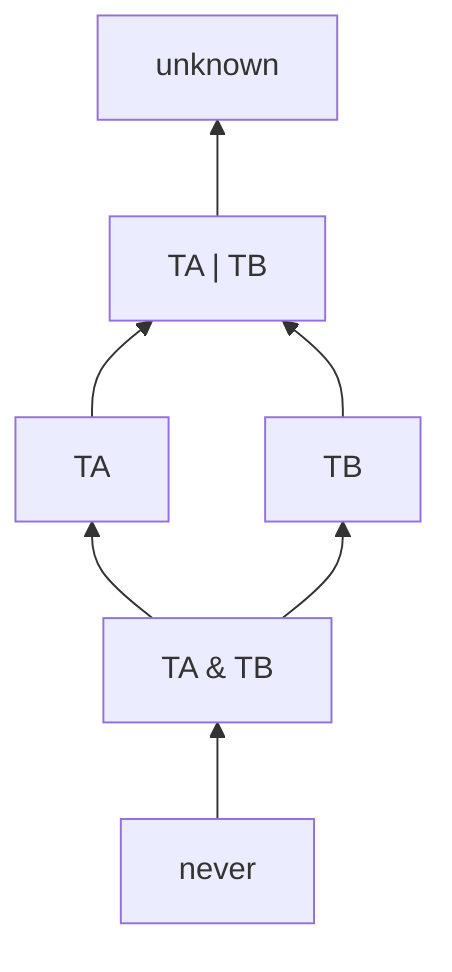
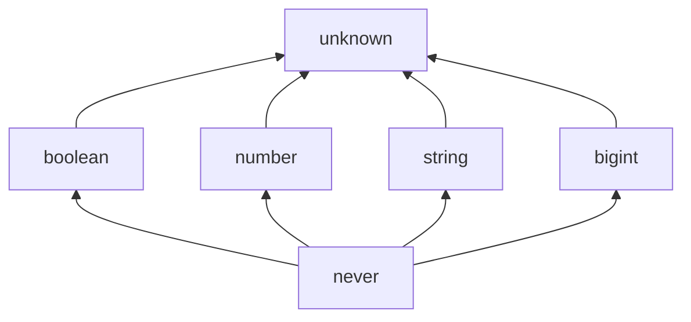
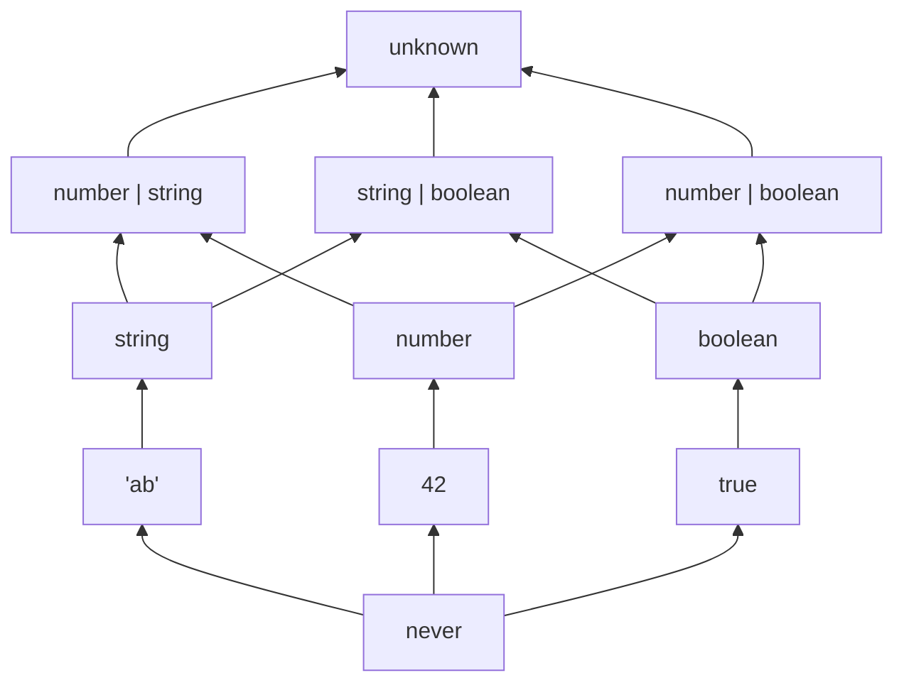
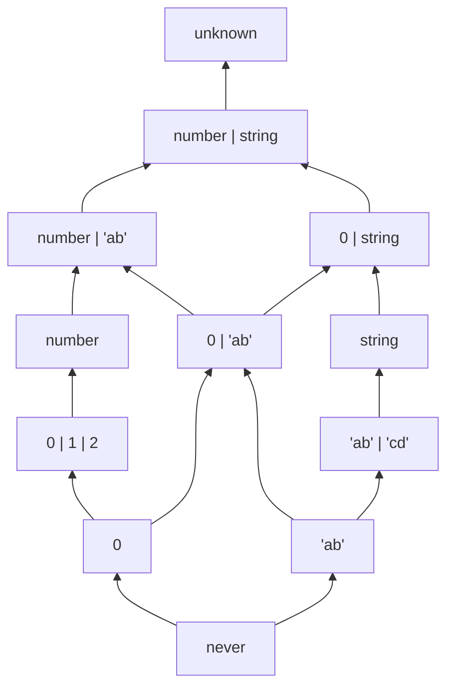
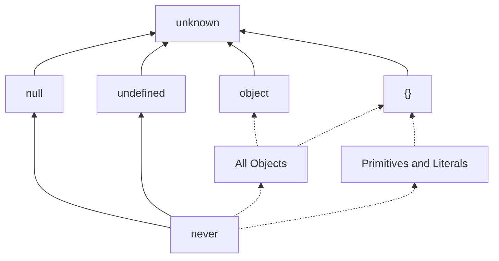
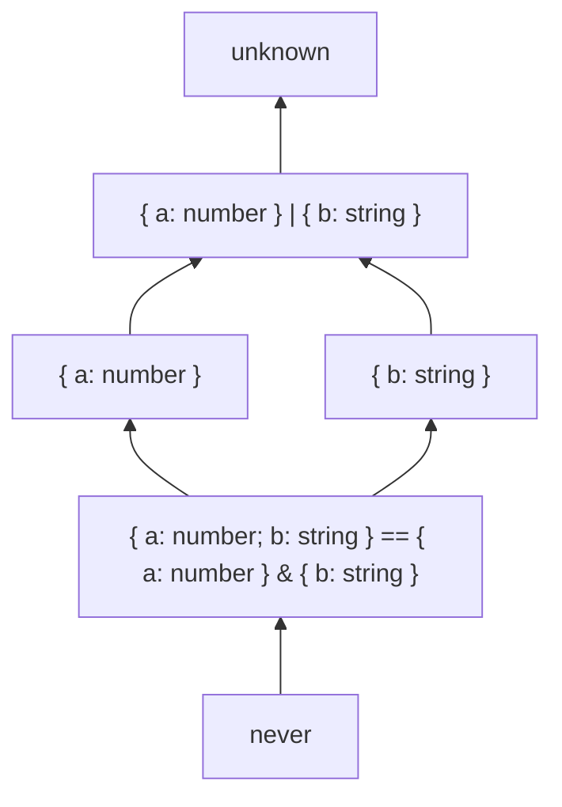
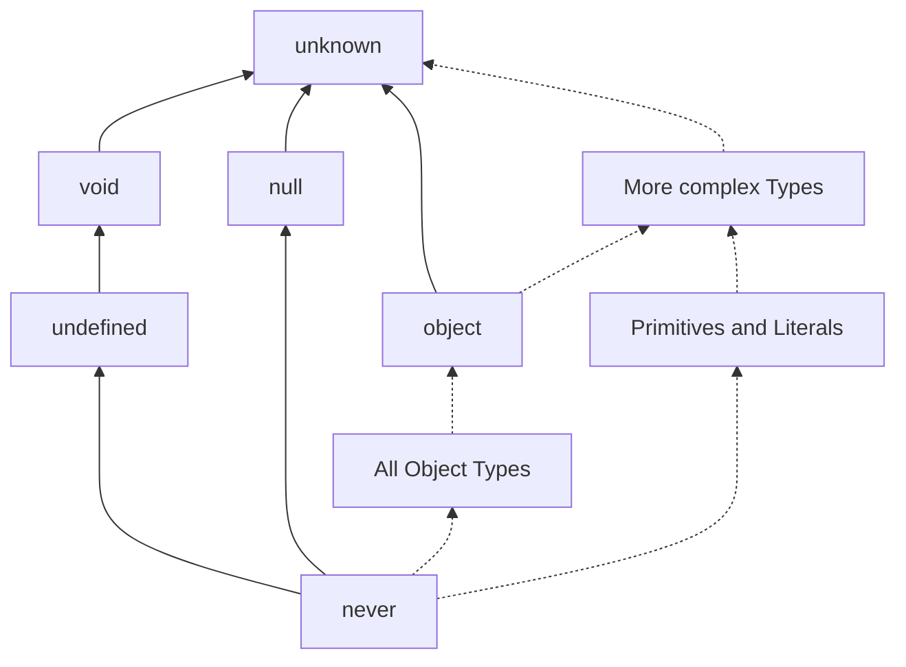
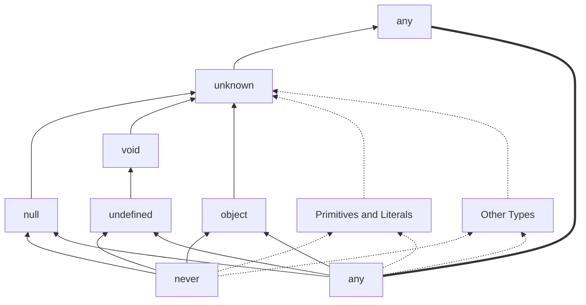

In the diagram `TA --> TB` means `TA extends TB` in TypeScript.
In practical terms it means (equivalently) that

- `TA` is *more specific* than `TB` (`TB` is *more general* than `TA`)
- we can use a variable of type `TA` anywhere that we could use a varibale of type `TB`

E.g. `f: (b: TB) => TC` and variable `a: TA`, then `f(a)` typechecks.
E.g. if `a: TA` and `b: TB`, then `b = a` typechecks.

However, we **cannot** always assign an *object literal* of type `TA` to a variable of type `TB`.
E.g. if both `TA` and `TB` are object types, then `const b: TB = { /* somethinig of type TA */}`{:.js} may not typecheck.

## Basic Operations

Types can be thought of as sets of possible values.
A value `v` has type `T` then means $v \in T$.
And `T1 extends T2` then means $T1 \subseteq T2$.

### Top and Bottom

For any type `T`:



In mathematical terms think of it as $\text{never} = \emptyset$, and $\text{unknown} = U$, where `U` is the set of all possible TypeScript values.
So `let v: never` means that `v` cannot exist (since it would be an element of the empty set), and `let w: unknown` means that `w` could be any vaule.

The TypeScript `any` type behaves differently.
It simply turns off the typechecker and has no mathematical meaning.
Avoid it if you can.

### Union and Intersection

For any types `TA`, `TB`, the union type `TA | TB` can be thought of as the mathematical $TA \cup TB$ and the intersection type `TA & TB` can be thought of as the mathematical $TA \cap TB$.
Then obviously the following holds:



along with any other laws for sets as boolean algebras.

Intersection only really makes sense for object types.
Otherwise it can easily end up as `never` (e.g. `number & string == never`).

## Basic Types



### Literals and Basic Unions

Individual strings and numbers can be their own types.
Think of the type `"ab"` as $\{\text{"ab"}\}$, and of the type `42` as $\{42\}$.



slightly more advanced



## Objects

The type `object` means any object (this includes functions, since in JS every function is also an object).
The type `{}` means "any non-nullish value". I.e. $\text{\{\}} = \text{unknown} \setminus \{ \text{null}, \text{undefined} \}$.



### Specificity



Let's call `TA = { a: number }` and `TB = { b: string }`, and let `TABI = TA & TB`.
Then actually `{ a: number; b: string } === TABI`.

#### Intuition

- A value satisfies type `TA` if it is an object including a field `a` of type `number` (and optionally any other fields)
- There are less objects satisfying `TABI` since the above set is restricted to only those object who also have a field `b` of type `string`
- A value satsisfies type `TABU = { a: number } | { b: string }` if satisfies either `TA` or `TB` (or both).
- `TABU` includes strictly more values than either `TA` or `TB`.

## null, undefined, void

See [TypeScript documentation](https://www.typescriptlang.org/docs/handbook/type-compatibility.html?#any-unknown-object-void-undefined-null-and-never-assignability).

For historical reasons, Typescript has two `nil` values, `null` and `undefined`.

The type `null` has exactly one value `null`.
The type `undefined` has exactly one value `undefined`.

There is also a special type `void` which apart from `never` and `unknown` is not comparable to any other type.



It is used strictly for the return type of a function;

## object and {}

## any

The `any` type breaks the Boolean Algebra.
The relationship `A --> B` as in if `v` is assignable to `A`, then it is also assignable to `B` does not correspond to `A` being a subset of `B` any longer.
That is because if `v: any`, then `v` is assignable to any type `T` (as if `any` were `never`), but at the same time if `w: T`, then `w` is assignable to `any` (as if `any` were `unknown`).
The only difference is that `unknown extends any`, but `any` does not extend `never`.



Avoid `any` if you can!

## Code for experiments

```ts
type Wn = {
  a: number;
};

type Rn = {
  readonly a: number;
};

type RaWn = readonly Wn[];

type RaRn = readonly Rn[];

type WaWn = Wn[];

type WaRn = Rn[];

type T01 = Wn extends Rn ? true : false; // TRUE
type T02 = Rn extends Wn ? true : false; // TRUE

type T03 = Wns extends Rns ? true : false; // TRUE
type T04 = Rns extends Wns ? true : false; // TRUE

type T05 = Wn extends Wns ? true : false; // TRUE
type T06 = Wns extends Wn ? true : false; // false

type T07 = Rn extends Rns ? true : false; // TRUE
type T08 = Rns extends Rn ? true : false; // false

type T09 = Rn extends Wns ? true : false; // TRUE
type T10 = Wn extends Rns ? true : false; // TRUE

type TTest21 = RaWn extends RaRn ? true : false; // TRUE
type TTest31 = WaRn extends RaRn ? true : false; // TRUE
type TTest43 = WaWn extends RaRn ? true : false; // TRUE

type TTest11 = RaRn extends RaWn ? true : false; // TRUE
type TTest32 = WaRn extends RaWn ? true : false; // TRUE
type TTest41 = WaWn extends RaWn ? true : false; // TRUE

type TTest42 = WaWn extends WaRn ? true : false; // TRUE

type TTest33 = WaRn extends WaWn ? true : false; // TRUE

type TTest12 = RaRn extends WaRn ? true : false; // false
type TTest22 = RaWn extends WaRn ? true : false; // false

type TTest13 = RaRn extends WaWn ? true : false; // false
type TTest23 = RaWn extends WaWn ? true : false; // false

// A extends B
// A is more specific
// B is more general
// we can use a of type A anywhere where we could use B.

// readonly field doesn't matter for extension.

// readonly array is always more general a writable array.

// writable array is always more specific than a readonly array

// a readonly array can never be more specific than a writable array

// a writable array can never ge more general than a readonly array

type Wns = {
  a: number | string;
};

type Rns = {
  readonly a: number | string;
};

// ALL TRUE
type T21 = Wns extends Rns ? true : false;
type T22 = Rns extends Wns ? true : false;
type T23 = Wn extends Wns ? true : false;
type T24 = Wn extends Rns ? true : false;
type T25 = Rn extends Wns ? true : false;
type T26 = Rn extends Rns ? true : false;

// ALL FALSE
type T33 = Wns extends Wn ? true : false;
type T34 = Rns extends Wn ? true : false;
type T35 = Wns extends Rn ? true : false;
type T36 = Rns extends Rn ? true : false;

// writability does not affect the prior relationship

type RaWns = readonly Wns[];
type RaRns = readonly Rns[];
type WaWns = Wns[];
type WaRns = Rns[];

type T41 = RaWn extends RaWns ? true : false; // TRUE
type T42 = RaWn extends WaWns ? true : false; // false

type T52 = number extends any ? true : false; // TRUE
type T54 = never extends any ? true : false; // TRUE
type T56 = unknown extends any ? true : false; // TRUE

type T55 = any extends unknown ? true : false; // TRUE

type T51 = any extends number ? true : false; // boolean
type T53 = any extends never ? true : false; // boolean
```
