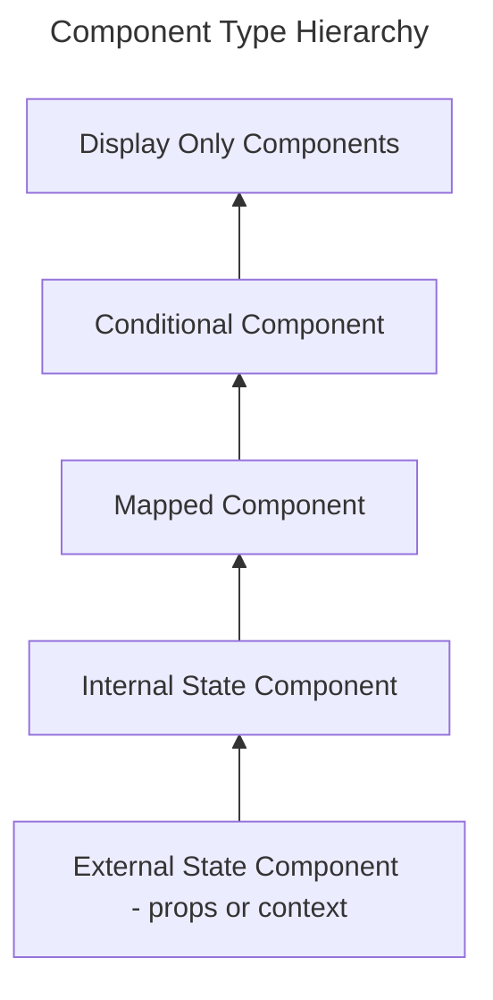
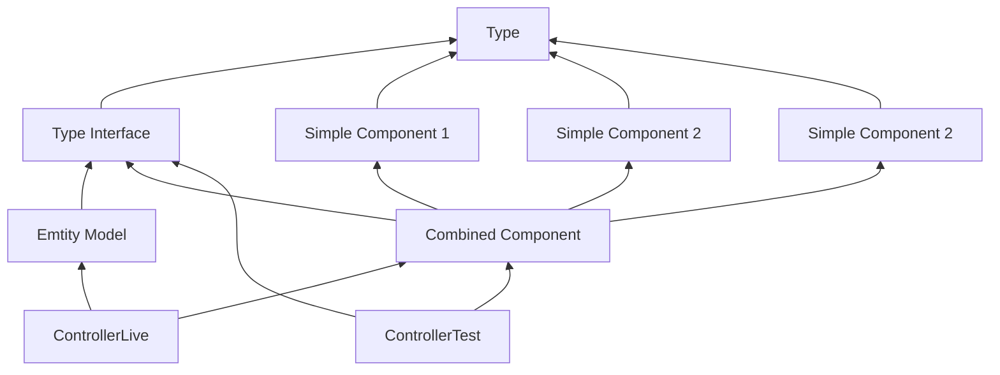

## TLDR

Designing clean pluggable components with design completely separated from content and thus providing a clean way to test them.



## The Hierarchy

### Display Only Component

```ts
const MyDisplayOnlyComponent = ({ state, action }) => (
  <button onClick={() => action()}>
    {state}
  </button>
)
```

### Maybe Component

```ts
const MyMaybeComponent = ({ maybeState, action }) => maybeState.pipe(
  Option.map((state) => <DisplayComponent state={state} action={action} />),
  Option.orElse(() => <FallbackComponent state={...} action={...} />)
);
```

### Conditional Component

```ts
const MyConditionalComponent = ({ state, action }) => Match.value(state).pipe(
  Match.when({ _tag: 'Option1'}, () => MyDisplayComponent1),
  Match.when({ _tag: 'Option2'}, () => MyDisplayComponent2),
  ...,
  Match.exhaustive,
  (DisplayComponent) => <DisplayComponent state={state} action={action} />
);
```

### Mapped Component

```ts
const MyMappedComponent = ({ state, action }) => <></>
```

----

Given a complicated component

```ts
const MyComponent = ({ externalPropState, externalPropActions }) => {
  const { externalContextState, externalContextActions } = useContext(...);
  const { internalState, internalActions } = useLocalStateAndActions(...);
  return (
    <>
    </>
  );
}
```

we can break it down and rewrite it as

```ts
const DisplayComp1 = ({state, actions}) => <> {...} </>
const DisplayComp2 = ({state, actions}) => <> {...} </>
const DisplayComp3 = ({state, actions}) => <> {...} </>

const CombinedComp = ({externalState, externalActions}) => {
  const { internalState, internalActions } = useLocal({externalState, externalActions});
  return (
    <>
      <DisplayComp1 {...}/>
      <DisplayComp2 {...}/>
      <DisplayComp3 {...}/>
    </>
  )
}

const FullComp = () => {
  const { state, actions } = useContext(...);
  return (
    <CombinedComp {...{ state, actions } } />
  )
}
```

And here is the dependency diagram:


